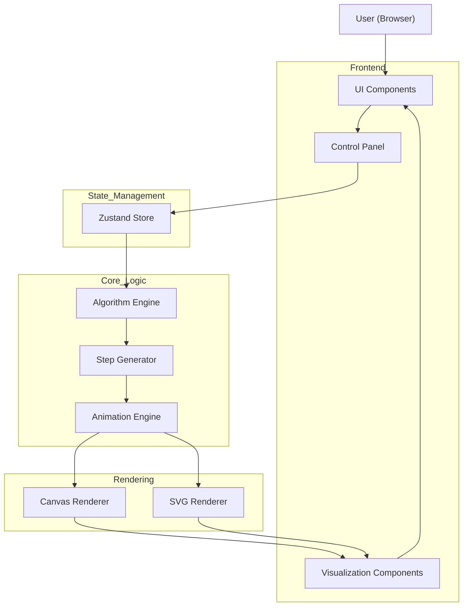

# 📘 Web-Based Data Structures & Algorithms Visualizer

An interactive educational web application designed to help students and developers understand the internal working of fundamental data structures and algorithms through **step-by-step visual animations**.


## 🎯 Key Features

- ✅ **Step-by-step visual animations** of algorithms
- ✅ **Interactive controls** (play, pause, step forward/backward, speed adjustment)
- ✅ **Clean separation** of algorithm logic from visualization
- ✅ **Modular and extensible** architecture
- ✅ Support for **sorting, searching, trees, graphs, stacks, and queues**

## 🛠️ Technology Stack

### Frontend
- **React** - Component-based UI architecture
- **TypeScript** - Type-safe code
- **Vite** - Ultra-fast development and build tool
- **Tailwind CSS** - Utility-first styling

### Backend
- **Node.js + Express** - HTTP API layer
- **TypeScript** - Shared types across the stack
- **Prisma ORM** - Type-safe access to PostgreSQL
- **PostgreSQL** - Durable relational datastore

### Visualization
- **SVG** - For trees, graphs, linked lists
- **HTML Canvas** - For sorting and array animations

### State Management
- **Zustand** - Lightweight state management

## 📁 Project Structure

```
dsa-visualizer/
├── docs/                 # Technical documentation, diagrams, screenshots
├── src/                  # Frontend application (React + Vite)
│   ├── components/       # Reusable UI components
│   ├── context/          # React context & state wrappers
│   ├── data/             # Algorithm data constants
│   ├── hooks/            # Custom React hooks
│   ├── pages/            # Main application screens & visualizers
│   └── utils/            # Helper functions
└── server/               # Backend service (Express + Prisma)
        ├── src/              # Application source
        ├── prisma/           # Database schema & migrations
        └── .env.example      # Backend environment template
```

## 🚀 Getting Started

### Prerequisites
- Node.js (v18 or higher)
- npm or yarn
- PostgreSQL 14+ (Docker or local install)

### Installation

1. **Fork the repository:**
   Click the "Fork" button at the top right of this repository's GitHub page to create a copy under your own account.

2. **Clone the repository:**
```bash
git clone https://github.com/<your-username>/Data-Structures-Visualizer.git
cd Data-Structures-Visualizer
```

3. **Install frontend dependencies:**
```bash
npm install
```

4. **Copy frontend environment template:**
```bash
cp .env.example .env # use: copy .env.example .env (Windows)
```
The default `VITE_API_URL` points to the local Express server (`http://localhost:4000`).

5. **Install backend dependencies:**
```bash
cd server
npm install
```

6. **Configure backend environment:**
```bash
cp .env.example .env # use: copy .env.example .env (Windows)
```
Update `DATABASE_URL` with your PostgreSQL credentials and set a strong `JWT_SECRET`.

7. **Run database migrations:**
```bash
npx prisma migrate dev
```

8. **Seed algorithm metadata:**
```bash
npm run prisma:seed
```

9. **Start backend API:**
```bash
npm run dev
```

10. **Start frontend dev server (new terminal):**
```bash
cd ..
npm run dev
```

11. **Open your browser:**
        Navigate to `http://localhost:3000`

### Build for Production

```bash
npm run build
```

The production-ready files will be in the `dist/` directory.

### Backend Testing

```bash
cd server
npm run test
```

The Jest suite covers health checks, catalog queries, and authentication flows using mocked Prisma interactions.

## 🎨 Architecture



For a comprehensive breakdown of our system design, please see our detailed [Architecture Documentation](./docs/README_DOCS.md), which includes:

1. **High-Level System Architecture Diagram**
2. **Component Interaction Diagram**
3. **Data Flow Diagram (DFD)**
4. **Sequence Diagram for Visualizations**
5. **Module Dependency Diagram**
6. **Deployment Architecture**
7. **UML Diagrams (Class & State)**

### Key Principles

1. **Separation of Concerns**: Algorithm logic is completely separate from visualization
2. **Step-Based Execution**: Algorithms generate logical steps, not visual instructions
3. **Centralized Animation**: Single animation engine handles all visualizations
4. **Type Safety**: Full TypeScript coverage for reliability

## 📚 Algorithm & Data Structure Categories

### Data Structures

#### **Arrays**
- **Standard Operations:** Search (Linear/Binary), Insert, Remove, Update
- **Applications:** Array Reversal, Two Sum (Sorted), Cycle Detection (Array as Graph)

#### **Linked Lists** (Singly, Doubly, Circular)
- **Standard Operations:** Traversal (Iterative/Recursive), Insertion, Deletion, Searching, Reverse
- **Applications:** Cycle Detection (Floyd), Merge Two Lists, Check Palindrome, Intersection Point, Odd Even Rearrange

#### **Stacks**
- **Standard Operations:** Push, Pop, Peek
- **Applications:** Reverse String, Balanced Parentheses, Postfix Evaluator, Browser History Simulator

#### **Queues**
- **Standard Operations:** Enqueue, Dequeue, Peek
- **Applications:** Binary Number Generator, Hot Potato Simulator

#### **Trees** (General & BST & AVL)
- **Standard Operations:** Insert, Delete, Search, Traversals (In-order, Pre-order, Post-order, BFS, Zig-Zag), Find Min/Max
- **Applications:** Validate BST, Calculate Height/Diameter, Lowest Common Ancestor (LCA), Various Views (Left, Right, Top, Bottom)

#### **Graphs** (Directed, Undirected, Weighted)
- **Standard Operations:** BFS, DFS, Check Connectivity, Detect Cycle, Highlight Neighbors
- **Applications:** Shortest Path (Dijkstra, A*), Minimum Spanning Tree (Prim, Kruskal), Topological Sort, Network Flow (Ford-Fulkerson)

### Sorting Algorithms
- **Standard Sorts:** Bubble Sort, Selection Sort, Insertion Sort
- **Advanced Sorts:** Merge Sort, Quick Sort

### Advanced Algorithms
#### **Recursion**
- **Standard Operations:** Fibonacci Sequence Computation
- **Upcoming Applications:** Factorial Calculation

## 🎯 Development Roadmap

- [x] Project initialization
- [x] Array Operations visualizer
- [x] Linked List visualizer
- [x] Sorting visualizer
- [x] Tree visualizer
- [x] Graph visualizer
- [x] Stack & Queue visualizer
- [x] Recursion visualizer
- [x] Complexity analysis display
- [ ] Code editor integration
- [ ] Custom input support
- [ ] Algorithm comparison mode
- [ ] User accounts (optional backend)

## 🤝 Contributing

Contributions are welcome! Please feel free to submit a Pull Request.

1. Fork the project
2. Create your feature branch (`git checkout -b feature/AmazingFeature`)
3. Commit your changes (`git commit -m 'Add some AmazingFeature'`)
4. Push to the branch (`git push origin feature/AmazingFeature`)
5. Open a Pull Request

## 📄 License

This project is licensed under the MIT License.

## 🎓 Educational Purpose

This project is designed for educational purposes to help students and developers:
- Understand algorithm internals visually
- Learn best practices in React/TypeScript development
- Explore clean architecture patterns
- Build interactive web applications

## 📧 Contact

For questions or suggestions, please open an issue on GitHub.

---

**Built with ❤️ for learners and developers**
