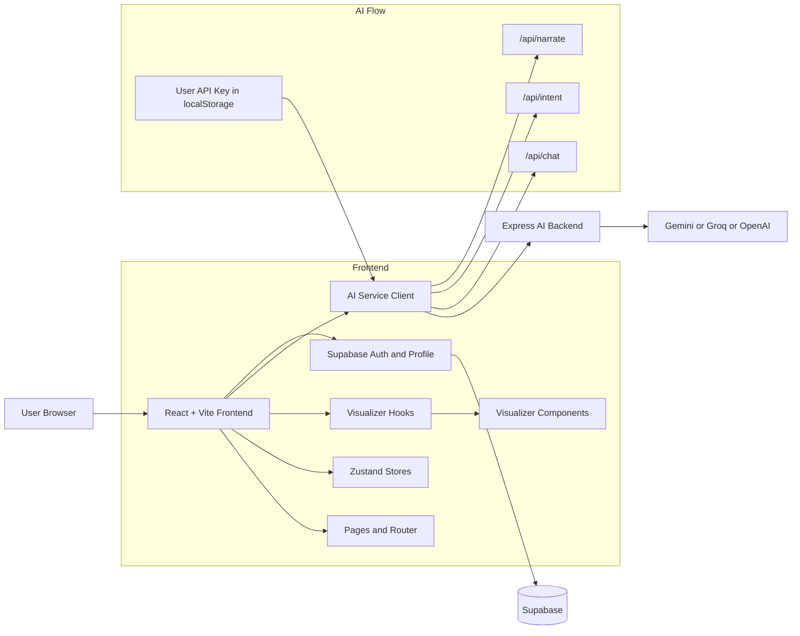
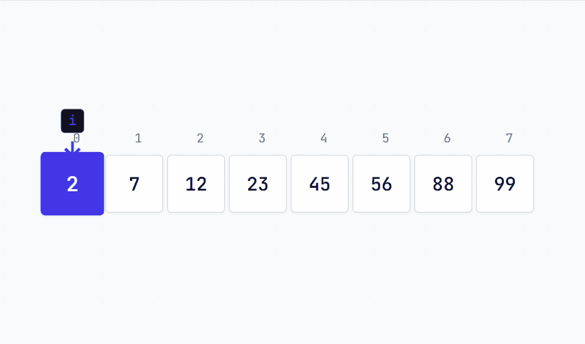
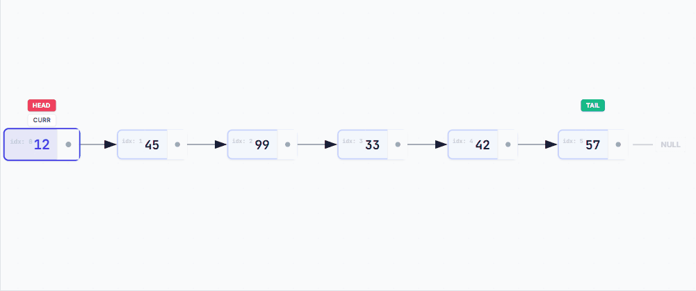
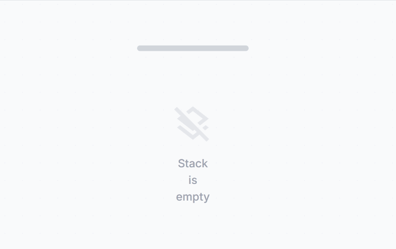
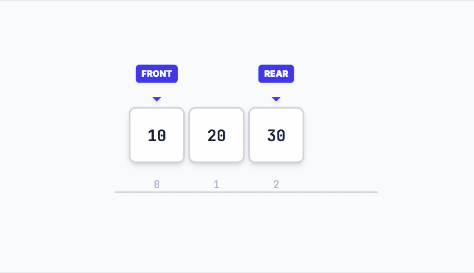
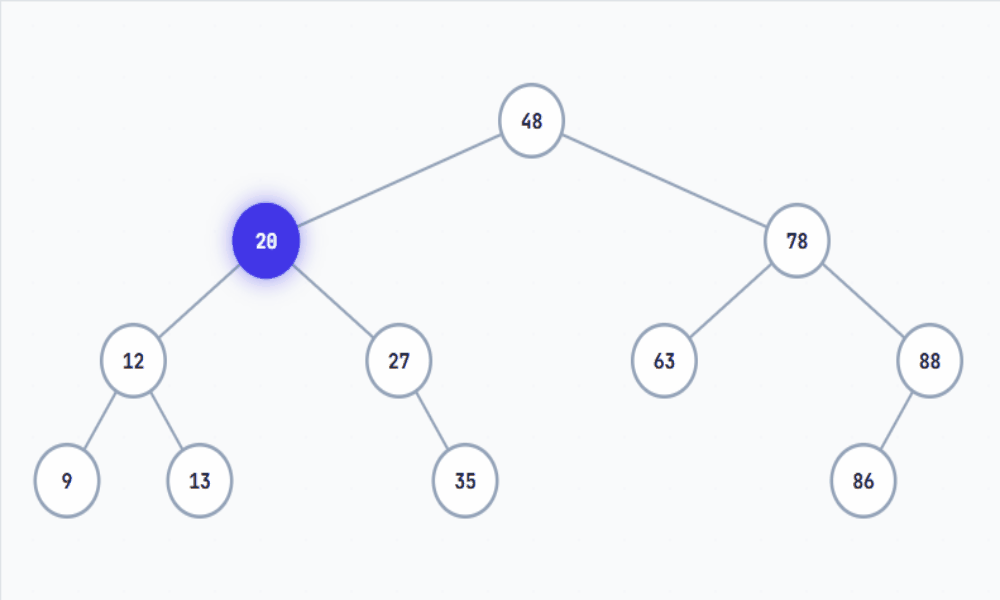
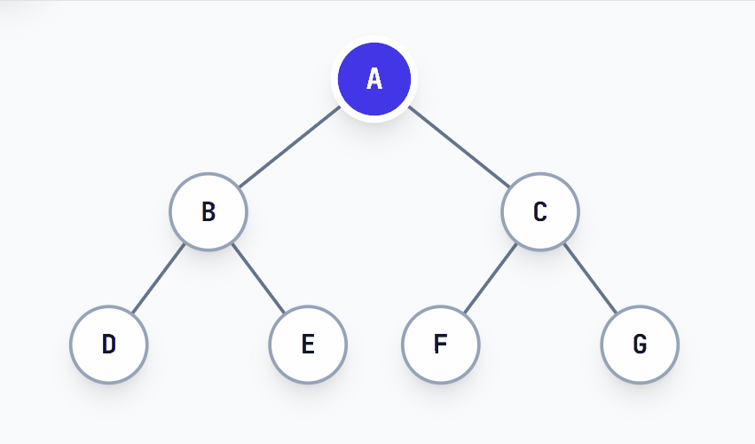
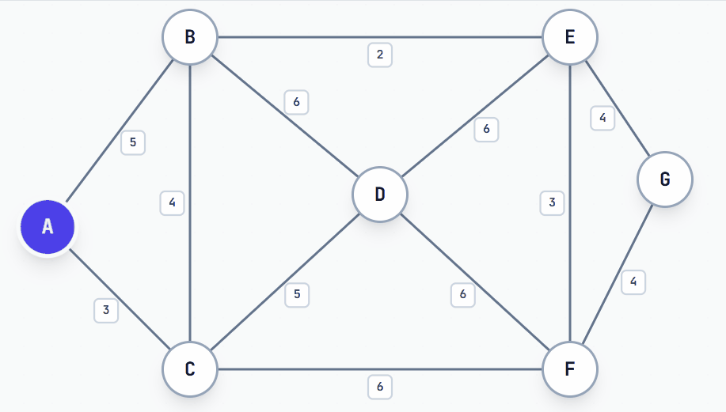
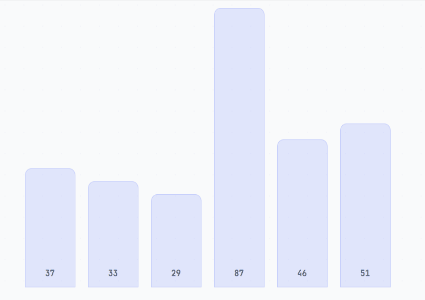

# Data Structures Visualizer

An interactive web app for learning data structures and algorithms through step-by-step visual simulation, AI-assisted tutoring, and voice interaction.

<p align="center">
  
</p>


## Table of Contents
- Overview
- Architecture (Mermaid)
- Product Visuals
- Key Features
- What's New
- Tech Stack
- Project Structure
- Getting Started
- Environment Variables
- AI Features and Privacy
- API Endpoints
- Deployment
- Troubleshooting
- Scripts
- Contributing
- License

## Overview
Data Structures Visualizer helps learners understand algorithm behavior by animating each operation frame-by-frame. It supports multiple modules (arrays, linked lists, stacks, queues, trees, graphs, sorting, recursion) and includes AI capabilities for tutoring, narration, and voice commands.

## Architecture (Mermaid)


```mermaid
flowchart LR
    User[User Browser] --> UI[React + Vite Frontend]

    subgraph Frontend
      UI --> Routes[Pages and Router]
      UI --> Stores[Zustand Stores]
      UI --> Hooks[Visualizer Hooks]
      Hooks --> Components[Visualizer Components]
      UI --> AIClient[AI Service Client]
      UI --> Auth[Supabase Auth and Profile]
    end

    AIClient --> API[Express AI Backend]
    API --> Providers[Gemini or Groq or OpenAI]

    Auth --> Supabase[(Supabase)]

    subgraph AI Flow
      Key[User API Key in localStorage] --> AIClient
      AIClient --> ChatEndpoint["/api/chat"]
      AIClient --> IntentEndpoint["/api/intent"]
      AIClient --> NarrateEndpoint["/api/narrate"]
    end
```

## Product Visuals

### Home and Core Modules

| Module | Demo |
| --- | --- |
| Arrays |  |
| Linked List |  |
| Stack |  |
| Queue |  |

### Advanced Modules

| Module | Demo |
| --- | --- |
| Trees (BST) |  |
| Graphs (DFS/BFS) |  |
| Graph Data Structures |  |
| Sorting |  |

### Additional Learning Visuals

| Module | Demo |
| --- | --- |
| Recursion |  |
| Heap |  |
| Hash Table |  |

## Key Features
- Interactive visualizers for core DSA topics.
- Playback controls: play, pause, step forward/backward, jump, speed control.
- AI Tutor panel for context-aware explanations.
- AI narration for algorithm steps.
- Voice input in chatbot with transcript and command support.
- Voice output (text-to-speech) in chatbot with optional auto-speak.
- User authentication and profile management.
- Per-user API key management for AI providers.
- Dedicated AI Data and Privacy page.

## What's New
Recent updates included in this repository:

- Persistent user AI key storage:
  - AI provider/key now persists in browser `localStorage` per user.
  - Key is no longer requested repeatedly on browser reopen.
  - Added explicit `Remove Key` action in Profile.

- AI key flow modernization:
  - Chat, intent parsing, and narration all use the same user-provided provider/key.
  - Removed dependency on fixed developer key for narration.

- Deployment API fallback improvements:
  - AI service base URL now resolves from:
    1. `VITE_AI_SERVER_URL`
    2. `VITE_API_URL`
    3. local dev fallback (`http://localhost:3001`)
  - Better 405 guidance when backend route is missing/misconfigured.

- Voice UX upgrades:
  - Start/stop listening toggle.
  - Interim transcript preview.
  - Improved error states and cleanup.
  - Voice input now consistently reaches AI response flow.
  - Optional TTS playback and auto-voice mode.
  - Brave browser handling improved for speech `network` errors (auto-retry + guidance).

- Security and accessibility enhancements:
  - External profile key links include `rel="noreferrer noopener"`.
  - New-tab links include accessible labeling.

- Privacy documentation:
  - Added `/ai-data-privacy` page and navigation links.

## Tech Stack

### Frontend
- React 18
- TypeScript
- Vite
- Tailwind CSS
- React Router (`HashRouter`)
- Zustand

### Backend
- Node.js
- Express
- `@google/generative-ai` (Gemini SDK support)
- CORS + rate limiting

### Auth and Data Services
- Supabase (auth/profile/storage integrations in frontend)

## Project Structure

```text
Data-Structures-Visualizer/
├── src/
│   ├── app/                # Router and app shell
│   ├── components/         # UI and visualization components
│   ├── context/            # Auth, theme, layout contexts
│   ├── hooks/              # Visualizer logic hooks
│   ├── pages/              # Route pages
│   ├── services/           # AI service integration
│   ├── store/              # Zustand stores
│   └── ...
├── server/
│   ├── server.js           # Express AI backend
│   └── package.json
├── supabase/
│   └── functions/
├── supabase-proxy/
├── docs/
└── README.md
```

## Getting Started

### Prerequisites
- Node.js 18+
- npm 9+

### 1. Install dependencies

From project root:

```bash
npm install
```

For backend:

```bash
cd server
npm install
```

### 2. Configure environment
Create `.env` in the root (frontend) and set required values.

Common frontend keys:
- `VITE_SUPABASE_URL`
- `VITE_SUPABASE_ANON_KEY`
- `VITE_AI_SERVER_URL` (recommended in deployed environments)
- `VITE_API_URL` (fallback if `VITE_AI_SERVER_URL` is not set)

Backend (`server/.env`) optional values:
- `PORT` (default `3001`)
- `AI_REQUEST_TIMEOUT_MS` (default `10000`)

Note: user-provided AI keys are now used for chat, intent, and narration. A fixed server Gemini key is not required for these flows.

### 3. Run locally

Start backend:

```bash
cd server
npm start
```

Start frontend (new terminal, root):

```bash
npm run dev
```

Open the app at `http://localhost:3000`.

## Environment Variables

### Frontend (.env)

```env
VITE_SUPABASE_URL=...
VITE_SUPABASE_ANON_KEY=...
VITE_AI_SERVER_URL=http://localhost:3001
# Optional fallback if AI server URL is not set
VITE_API_URL=http://localhost:3001
```

### Backend (server/.env)

```env
PORT=3001
AI_REQUEST_TIMEOUT_MS=10000
```

## AI Features and Privacy

### Provider keys
Users can configure their own API keys in:
- `Profile -> AI Tutor Settings`

Supported providers:
- Gemini
- Groq
- OpenAI

Key links are provided in UI and open in a new tab.

### Storage model
- Provider and API key are stored locally in browser storage per user.
- Keys can be updated or removed from Profile.

### Privacy page
- AI-specific privacy details are available at:
  - `/ai-data-privacy`
- General privacy page:
  - `/privacy`

## API Endpoints

Backend routes exposed by `server/server.js`:
- `POST /api/chat` - AI tutor responses.
- `POST /api/intent` - Voice/command intent extraction.
- `POST /api/narrate` - Narration generation for visualizer steps.

## Deployment

### Frontend
- Build:

```bash
npm run build
```

- Deploy static output from `dist/`.
- Ensure `VITE_AI_SERVER_URL` (or `VITE_API_URL`) points to your deployed backend base URL.

### Backend
- Deploy `server/` as a Node/Express service.
- Ensure CORS is configured for your frontend origin if needed.

## Troubleshooting

### 405 errors in AI chat on deployed app
Cause:
- Frontend is calling `/api/...` on static host instead of backend.

Fix:
- Set `VITE_AI_SERVER_URL` to your backend URL and redeploy frontend.
- Or set `VITE_API_URL` as fallback.

### Voice works in Chrome but fails in Brave
Possible cause:
- Brave privacy/shields can block speech services and raise network errors.

What to check:
- Allow microphone permission.
- Disable Shields for the site.
- Check Brave speech/privacy settings.

The app includes retry handling and user guidance for transient speech network failures.

### AI key prompts repeatedly
- Ensure key is saved in Profile.
- Keys persist per user in local storage.
- Use "Remove Key" only when you want to clear it.

## Scripts

### Frontend (root)
- `npm run dev` - start Vite dev server.
- `npm run build` - type-check and production build.
- `npm run preview` - preview production build locally.
- `npm run lint` - run ESLint.

### Backend (`server/`)
- `npm start` - start Express server.
- `npm run build` - no-op build message.

## Contributing
Contributions are welcome.

1. Fork the repository.
2. Create a feature branch.
3. Make your changes.
4. Run build/lint checks.
5. Open a pull request.

## License
This project is licensed under the MIT License.
