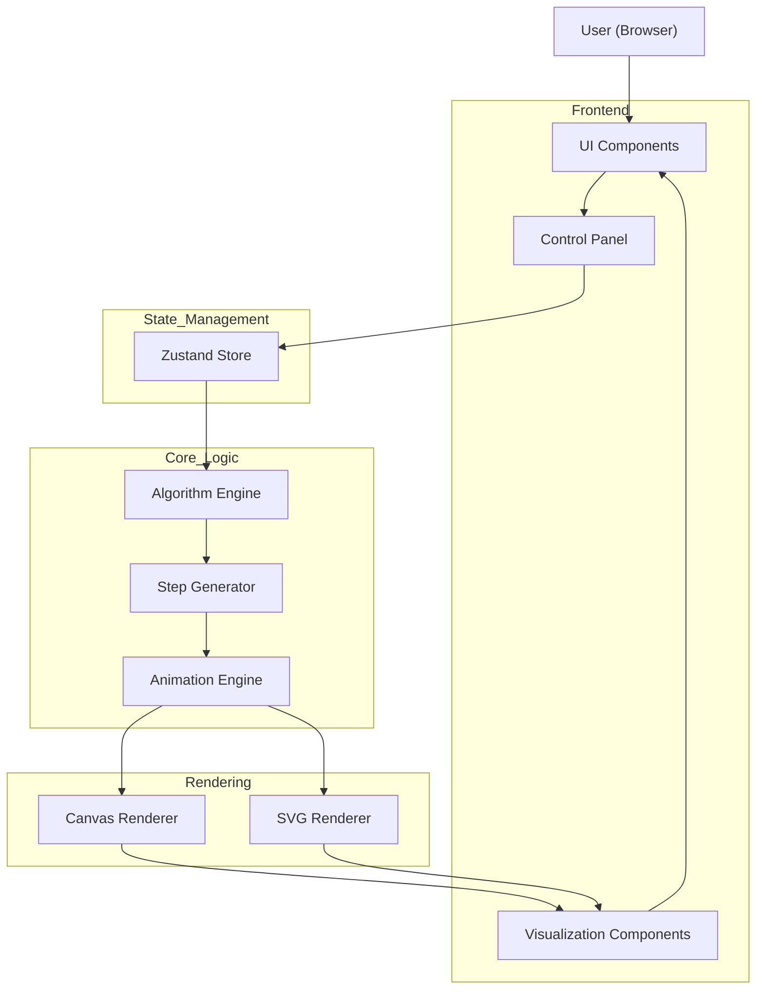
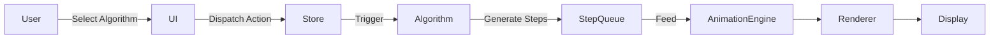
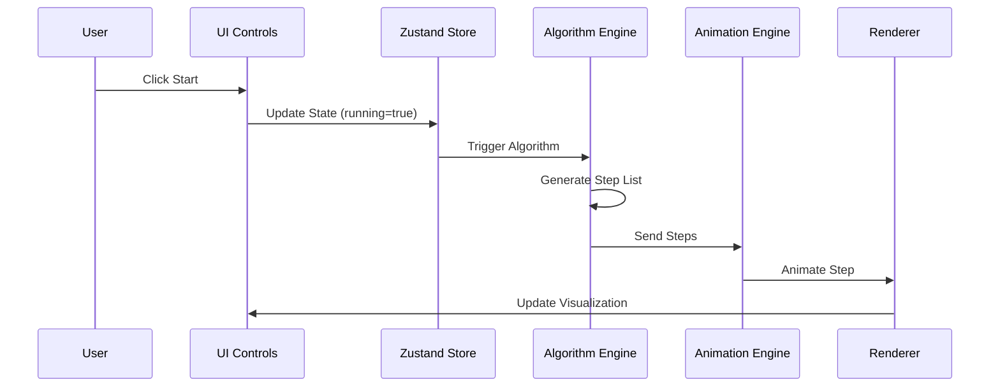
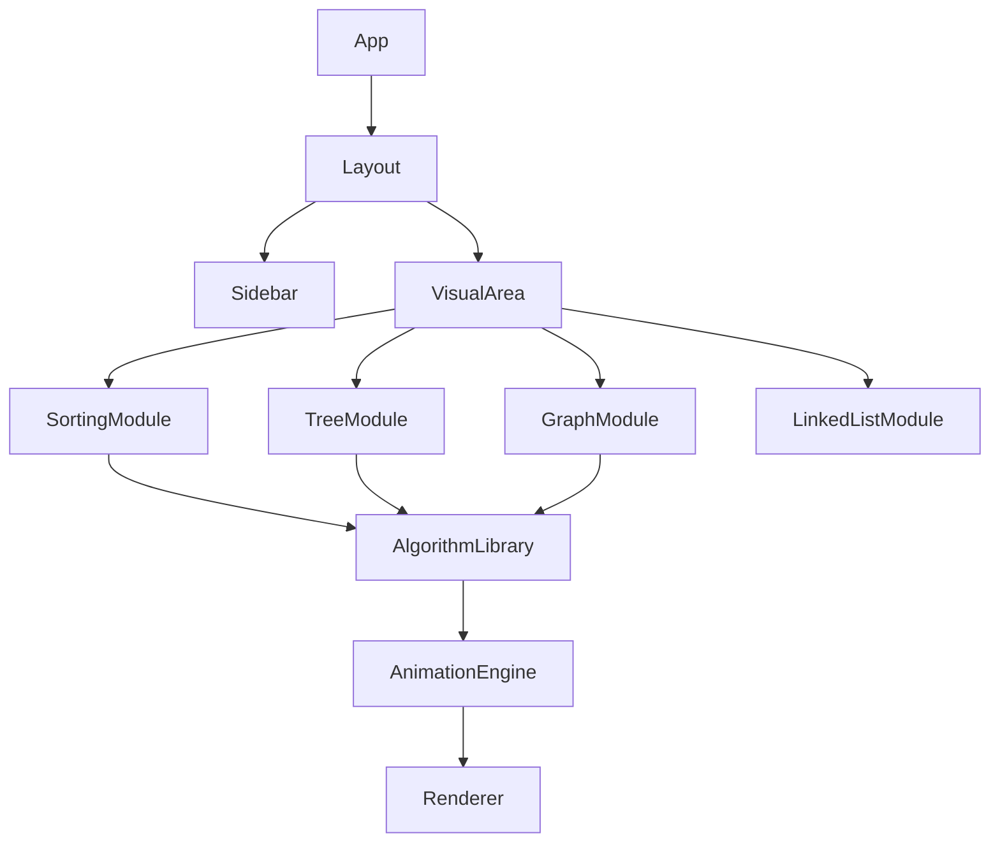
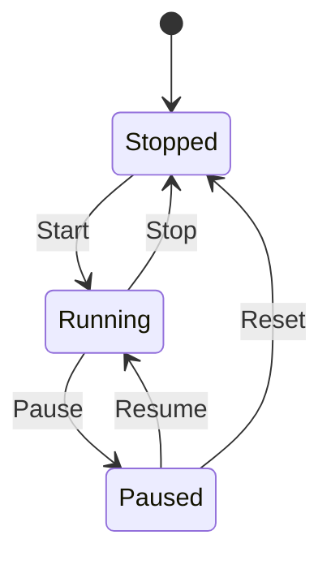
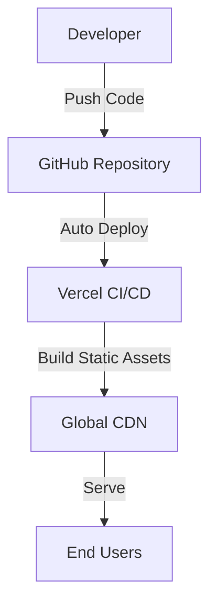
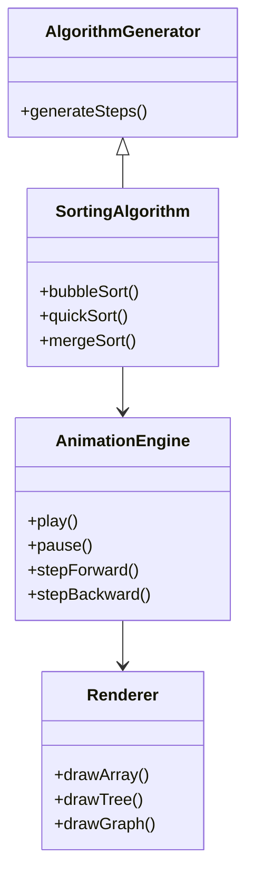

# System Architecture

This document outlines the architectural diagrams and data flow for the Data Structures & Algorithms Visualizer.

## 1. High-Level Architecture Diagram

This diagram shows how major components of your application are structured and interact with each other.

**Explanation:**
- **React Components** manage the UI and interact with user controls.
- **Zustand** centralizes application state (current animation step, speeds, selected algorithm).
- **Algorithm Engine** defines data structure operations and yields abstract "steps" representing their logic, separate from visuals.
- **Animation Engine** interprets those steps into animations using either SVG (for trees/graphs) or Canvas (for sorting and arrays).
- **Hosted** as a static site (Vercel deployment).

## 2. Data Flow Diagram (Level 1)

This shows how data moves through the system.

**Highlights:**
- Algorithm logic generates step sequences instead of immediate UI changes — a clean separation.
- Animation engine interprets steps to draw UI visuals.

## 3. Sequence Diagram (When User Clicks "Start")

Shows the timing when an algorithm is started:

**Shows timing:**
- UI control triggers state update.
- Algorithm logic yields ordered sequence of logical steps.
- Animation engine interprets those steps via renderer.

## 4. Component Dependency Diagram

Code organization view:

**Note:** Separation ensures testability & modular updates; e.g., new DSA logic can be plugged in without touching UI code.

## 5. State Diagram (Visualization Lifecycle)

Visualizes the different states during execution:

## 6. Deployment Architecture (Vercel)

Vercel builds React + Vite front-end as static assets and serves globally as a high-performance SPA.

## 7. Clean UML Class Diagram (Conceptual)

Logic & state relationships:

