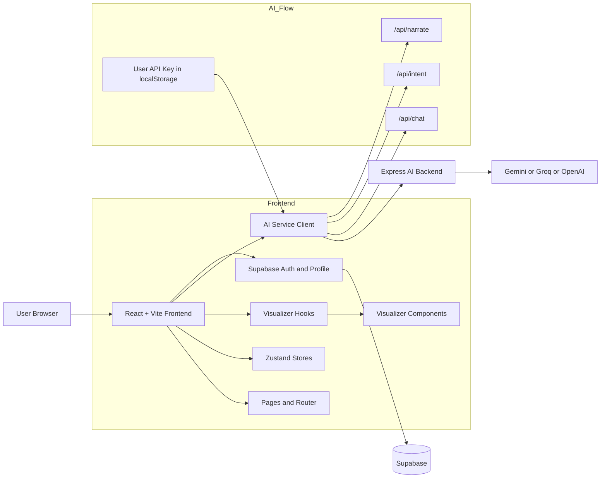
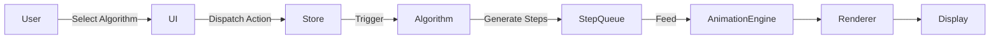
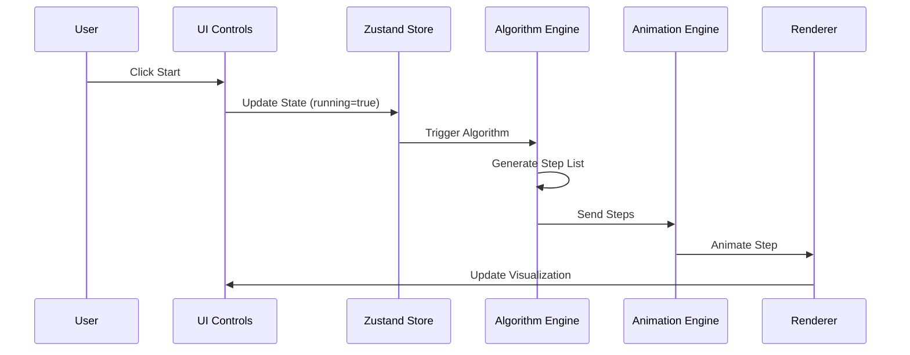
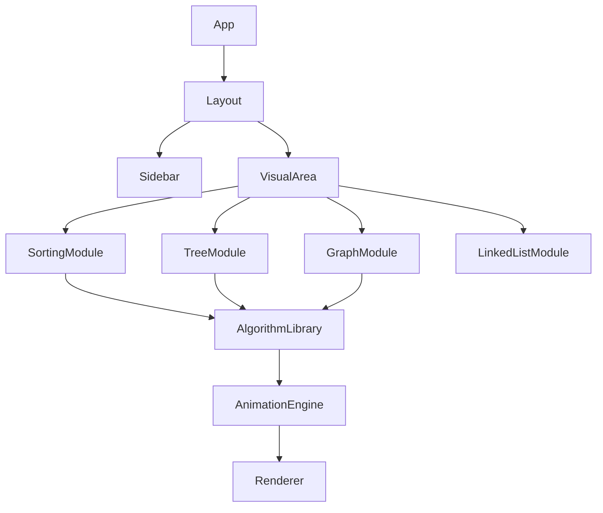
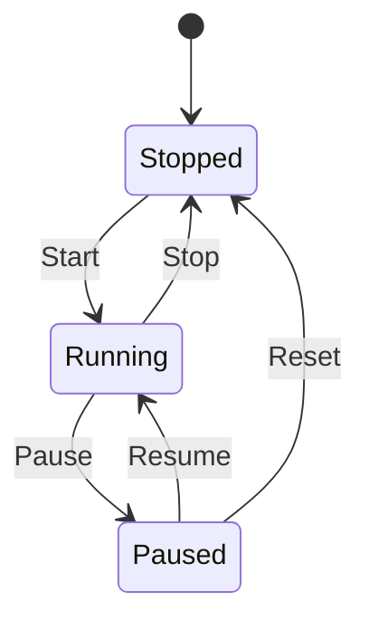
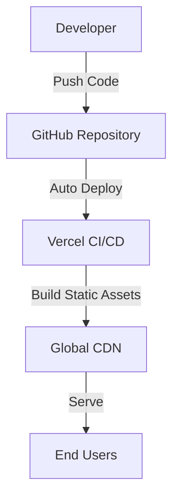
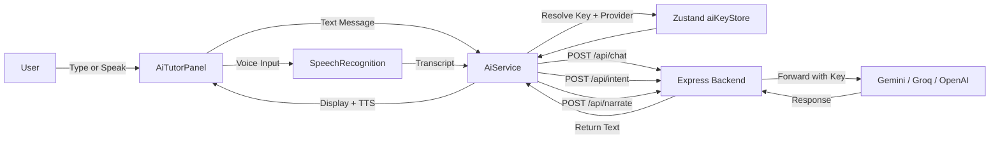
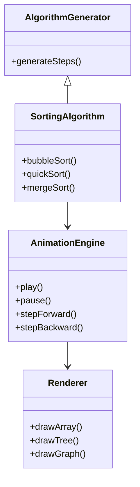
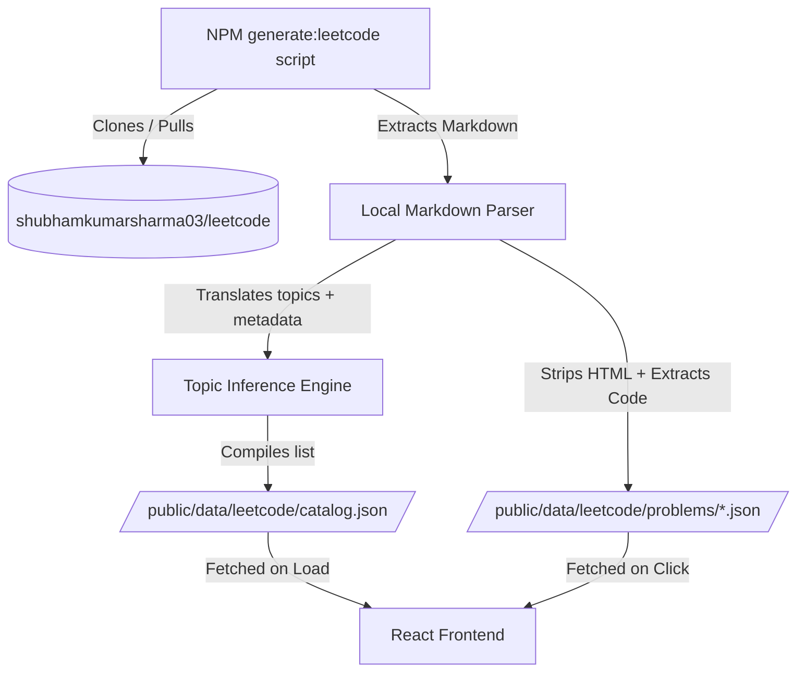

# System Architecture

This document outlines the architectural diagrams and data flow for the Data Structures & Algorithms Visualizer.

## 1. High-Level Architecture Diagram

This diagram shows how major components of your application are structured and interact with each other, including the AI subsystem.

```mermaid
flowchart LR
    User[User Browser] --> UI[React + Vite Frontend]

    subgraph Frontend
      UI --> Routes[Pages and Router]
      UI --> Stores[Zustand Stores]
      UI --> Hooks[Visualizer Hooks]
      Hooks --> Components[Visualizer Components]
      UI --> AIClient[AI Service Client]
      UI --> Auth[Supabase Auth and Profile]
    end

    AIClient --> API[Express AI Backend]
    API --> Providers[Gemini or Groq or OpenAI]

    Auth --> Supabase[(Supabase)]

    subgraph AI_Flow
      Key[User API Key in localStorage] --> AIClient
      AIClient --> ChatEndpoint["/api/chat"]
      AIClient --> IntentEndpoint["/api/intent"]
      AIClient --> NarrateEndpoint["/api/narrate"]
    end
```

**Explanation:**
- **React + Vite Frontend** manages all UI rendering, routing, and user interactions.
- **Zustand Stores** centralize state: current animation step, speed, selected algorithm, and AI key/provider.
- **Visualizer Hooks** define data structure operations and yield abstract "steps" for the animation engine.
- **AI Service Client** dispatches chat, intent, and narration requests to the Express backend using the user-provided API key stored in localStorage.
- **Supabase** handles user authentication and profile data.
- **Hosted** as a static site (Vercel) with the AI backend deployed as a separate serverless function.

## 2. Data Flow Diagram (Level 1)

This shows how data moves through the system.

```mermaid
flowchart LR
    User -->|Select Algorithm| UI
    UI -->|Dispatch Action| Store
    Store -->|Trigger| Algorithm
    Algorithm -->|Generate Steps| StepQueue
    StepQueue -->|Feed| AnimationEngine
    AnimationEngine --> Renderer
    Renderer --> Display
```

**Highlights:**
- Algorithm logic generates step sequences instead of immediate UI changes — a clean separation.
- Animation engine interprets steps to draw UI visuals.

## 3. Sequence Diagram (When User Clicks "Start")

Shows the timing when an algorithm is started:

```mermaid
sequenceDiagram
    participant U as User
    participant UI as UI Controls
    participant S as Zustand Store
    participant A as Algorithm Engine
    participant AN as Animation Engine
    participant R as Renderer

    U->>UI: Click Start
    UI->>S: Update State (running=true)
    S->>A: Trigger Algorithm
    A->>A: Generate Step List
    A->>AN: Send Steps
    AN->>R: Animate Step
    R->>UI: Update Visualization
```

**Shows timing:**
- UI control triggers state update.
- Algorithm logic yields ordered sequence of logical steps.
- Animation engine interprets those steps via renderer.

## 4. Component Dependency Diagram

Code organization view:

```mermaid
graph TD
    App --> Layout
    Layout --> Sidebar
    Layout --> VisualArea

    VisualArea --> SortingModule
    VisualArea --> TreeModule
    VisualArea --> GraphModule
    VisualArea --> LinkedListModule

    SortingModule --> AlgorithmLibrary
    TreeModule --> AlgorithmLibrary
    GraphModule --> AlgorithmLibrary

    AlgorithmLibrary --> AnimationEngine
    AnimationEngine --> Renderer
```

**Note:** Separation ensures testability & modular updates; e.g., new DSA logic can be plugged in without touching UI code.

## 5. State Diagram (Visualization Lifecycle)

Visualizes the different states during execution:

```mermaid
stateDiagram-v2
    [*] --> Stopped
    Stopped --> Running : Start
    Running --> Paused : Pause
    Paused --> Running : Resume
    Running --> Stopped : Stop
    Paused --> Stopped : Reset
```

## 6. Deployment Architecture (Vercel)

Vercel builds React + Vite front-end as static assets and serves globally as a high-performance SPA.

```mermaid
flowchart TB
    Developer[Developer]
    GitHub[GitHub Repository]
    Vercel[Vercel CI/CD]
    CDN[Global CDN]
    Users[End Users]

    Developer -->|Push Code| GitHub
    GitHub -->|Auto Deploy| Vercel
    Vercel -->|Build Static Assets| CDN
    CDN -->|Serve| Users
```

## 7. AI Feature Data Flow

Shows how user voice/text input flows through the AI subsystem:

```mermaid
flowchart LR
    User -->|Type or Speak| AiTutorPanel
    AiTutorPanel -->|Text Message| AiService
    AiTutorPanel -->|Voice Input| SpeechRecognition
    SpeechRecognition -->|Transcript| AiService

    AiService -->|Resolve Key + Provider| KeyStore[Zustand aiKeyStore]
    KeyStore --> AiService

    AiService -->|"POST /api/chat"| Backend[Express Backend]
    AiService -->|"POST /api/intent"| Backend
    AiService -->|"POST /api/narrate"| Backend

    Backend -->|Forward with Key| Provider[Gemini / Groq / OpenAI]
    Provider -->|Response| Backend
    Backend -->|Return Text| AiService
    AiService -->|Display + TTS| AiTutorPanel
```

**Highlights:**
- User API keys are stored in `localStorage` via the `aiKeyStore` Zustand store and never sent to any server other than the selected AI provider.
- Voice input uses the browser `SpeechRecognition` API; the resulting transcript is passed directly to the same AI pipeline as typed messages.
- TTS playback uses the browser `SpeechSynthesis` API with an optional auto-speak toggle.

## 8. Clean UML Class Diagram (Conceptual)

Logic & state relationships:

```mermaid
classDiagram
    class AlgorithmGenerator {
        +generateSteps()
    }

    class SortingAlgorithm {
        +bubbleSort()
        +quickSort()
        +mergeSort()
    }

    class AnimationEngine {
        +play()
        +pause()
        +stepForward()
        +stepBackward()
    }

    class Renderer {
        +drawArray()
        +drawTree()
        +drawGraph()
    }

    AlgorithmGenerator <|-- SortingAlgorithm
    SortingAlgorithm --> AnimationEngine
    AnimationEngine --> Renderer
```

## 9. LeetCode Static Data Pipeline

This outlines how the 3,700+ LeetCode problems are processed and served statically locally and on GitHub Pages, bypassing traditional database architecture to guarantee 0 latency and 100% offline compliance natively.

```mermaid
flowchart TD
    Builder[NPM generate:leetcode script]
    Repo[(shubhamkumarsharma03/leetcode)]
    
    Builder -- Clones / Pulls --> Repo
    Builder -- Extracts Markdown --> Parser[Local Markdown Parser]
    
    Parser -- Translates topics + metadata --> MetaEngine[Topic Inference Engine]
    MetaEngine -- Compiles list --> Catalog[/public/data/leetcode/catalog.json/]
    Parser -- Strips HTML + Extracts Code --> JSON[/public/data/leetcode/problems/*.json/]

    Client[React Frontend]
    Catalog -- Fetched on Load --> Client
    JSON -- Fetched on Click --> Client
```

**Highlights:**
- CPU-intensive tasks like topic identification and RegEx cleanup happen exclusively during the Node.js Build Phase, dropping frontend latency from 3,000ms+ down to near 0ms natively.
- React UI virtualizes the 3,700 catalog problems at 60 items per-page loop to eliminate layout recalculations and DOM overload freezes.
- Code blocks are bundled inside the localized isolated JSON payloads, ensuring no additional GitHub requests are required just to open a valid solution template block.

